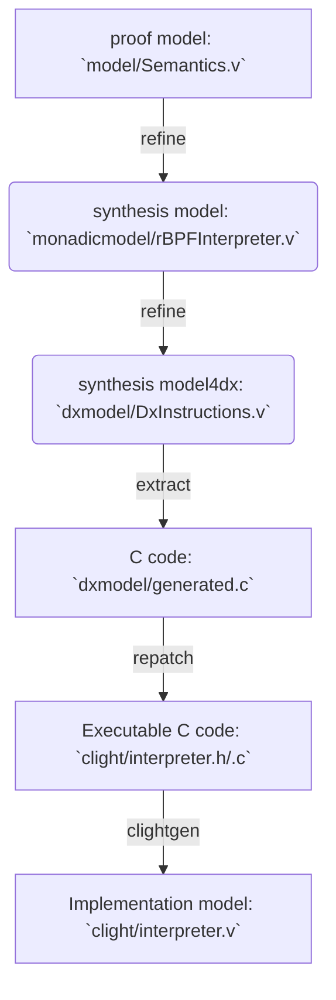
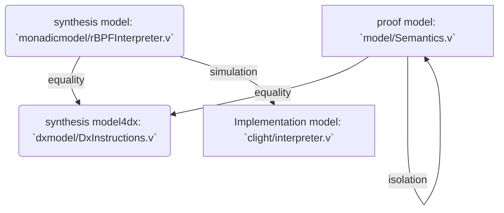

# Overview

_This repository contains the version of CertFC (or CertrBPF) presented in the middleware22 submission_

`CertFC` is a formally verified rBPF verifier + interpreter obtained by refinement of a Coq specification. ([rBPF](https://github.com/future-proof-iot/Femto-Container) is a register-based virtual machine of eBPF)

`CertrBPF` includes a verified C verifier and interpreter. The
verifier performs static checks to verify that the rBPF instructions
are syntactically correct.  If the verification succeeds, the program is run by the interpreter.
The static verification and the dynamic checks ensure *software fault isolation* of the running rBPF propgram.
Namely, we have the guarantee that:
- The interpreter never crashes. More precisely, the proved C  program is free of undefined behaviours such as division by zero or invalid memory accesses.
- All the memory accesses are performed in designated memory regions which are an argument of the interpreter.


The development of `CertrBPF` follows a refinement methodology with three main layers:
- The proof model: an executable Coq specification of the rBPF virtual machine
- The synthesis model: a refined and optimised executable Coq program that is close in style to a C program. 
  Eventually, we have the synthesis model (named dx model) which is compliant with the dx C extraction tool.
- The implementation model: the extracted C implementation in the form of CompCert Clight AST.

The dx tool is used to automatically translate the dx model into C
code. To make the extracted C code executable, a repatching process
(`repatch` and `verifier/repatch`) is necessary. The Clight AST is
automatically generated by
[VST-clightgen](https://github.com/PrincetonUniversity/VST).

The end-to-end mechanised proof is done in Coq:
- prove the proof model satisfies expected properties
- prove the refinement/equivalence among the proof model, the synthesis model, and the dx model
- prove the simulation (i.e. refinement) between the synthesis model and the implementation model.

To help the last step, we design a minimal logic for Clight (`clightlogic`).


`CertrBPF-verifier` consists of:
- The proof model & synthesis model (`verifier/comm, dxmodel, synthesismodel`): formalization of [the rBPF verifier](https://github.com/future-proof-iot/Femto-Container/blob/main/src/verify.c) and related dx configuration.
- The clight model (`verifier/clightmodel`)
- The property (`verifier/property/invariant.v`): `CertrBPF-verifier` implies a `verifier_invariant` used by the following `CertrBPF-interpreter`
- The property (`verifier/property/equivalence.v`): equivalence between the synthesis model and the dx model
- The simulaton (`verifier/simulation`): the clight model refines the synthesis model

`CertrBPF-interpreter` consists of:

- The proof model (`comm`+`model`): formal syntax and semantics of rBPF ISA

- The synthesis model (`monadicmodel`+`dxcomm`+`dxmodel`): an optimizated & formal rBPF interpreter model whose *code-style* is very close to the original rBPF C implementaion.

- The clight model (`clight`): re-extracted C to a CompCert Clight model by [VST-clightgen](https://github.com/PrincetonUniversity/VST)

- The isolation property (`isolation`): the invariants and the expected isolation property proof.

- The equivalence proof (`equivalence`): the proof model = the synthesis model = the dx model.

- The simulation proof (`simulation`): the clight model refines the synthesis model.

There are also some folders:

1. `benchmark_data`: all experiment data from our benchmarks.
2. `html`: the html files of the whole Coq development, it could be generated by `make all` or `make document` 
3. `repatch`: repatching the dx-extracted C implementation in order to make it executable.

We also provide a makefile command to generate html files (see [html](html)) in order to help users to read the coq development without executing Coq code (it uses the [coq2html](https://github.com/xavierleroy/coq2html) tool)

```shell
# make sure you have installed `coq2html` and compiled the CertrBPF before (i.e. `make all`)
make document
```


# Installation

see [install](INSTALL.md)

### Build of verified verifier and interpreter

```shell
cd /home/YOUR_NAME/CertrBPF/rbpf-dx
make all # you could always `make clean` firstly to get a clean environment
```

## Checking Coq code

`make all`
1. compiling the proof model, the synthesis model and the clight model;

2. extracting the verified C implementation; 

3. extracting Clight implemementation model;

4. checking the isolation proof of the proof model.

5. checking the equivalence relation (equality) among the proof model and two synthesis models.

6. checking the simulation relation proof (refinement) from Coq to Clight.

## Workflow: interpreter

- **compile**:


- **proof**:


# Benchmarks and Experiments


The benchmark applications are available in the `benchmark_data` directory. It
contains the main RIOT tree as used to produce the results and the two benchmark
applications.

The benchmark applications are automated. They will execute on the targeted
platform and output the benchmark results over the available serial console
after running the benchmark.


## Building for the native port of RIOT
```shell
# do the experiments on native board

# current folder: /home/YOUR_NAME/CertrBPF/rbpf-dx

# test bench_bpf_coq_incr
# compile CertBPF
make -C benchmark_data/bench_bpf_coq_incr/bpf
make -C benchmark_data/bench_bpf_coq_incr
# run on a native port using CertBPF
make -C benchmark_data/bench_bpf_coq_incr term
# complie original rBPF: Vanilla-rBPF
make -C benchmark_data/bench_bpf_coq_incr BPF_COQ=0 BPF_USE_JUMPTABLE=0
make -C benchmark_data/bench_bpf_coq_incr BPF_COQ=0 BPF_USE_JUMPTABLE=0 term

# test bench_bpf_coq_unit
# compile CertBPF
make -C benchmark_data/bench_bpf_coq_unit
make -C benchmark_data/bench_bpf_coq_unit term
# complie original rBPF: Vanilla-rBPF
make -C benchmark_data/bench_bpf_coq_unit BPF_COQ=0 BPF_USE_JUMPTABLE=0
make -C benchmark_data/bench_bpf_coq_unit BPF_COQ=0 BPF_USE_JUMPTABLE=0 term
```


## Building for the Nordic nRF52DK

To build the example applications, a toolchain is required. See the included
[RIOT documentation](benchmark_data/RIOT/doc/doxygen/src/getting-started.md) for
the exact tools required for each target platform.

In addition to this, **clang** and **llvm** with eBPF support are required for
the `bench_bpf_coq_incr` applications.

Compiling the applications for the Nordic nRF52DK development kit can be done with:

```Console
$ export BOARD=nrf52dk
$ make -C benchmark_data/bench_bpf_coq_incr/bpf
$ make -C benchmark_data/bench_bpf_coq_incr/
$ make -C benchmark_data/bench_bpf_coq_unit/
```

Flashing and running the example on the board can be done with:

```Console
$ export BOARD=nrf52dk
$ make -C benchmark_data/bench_bpf_coq_incr/ flash term
```

This flashes the application code on the board and will start a serial console
attached to the serial interface of the board.

*NB: all experiments data can be found at benckmark_data*
